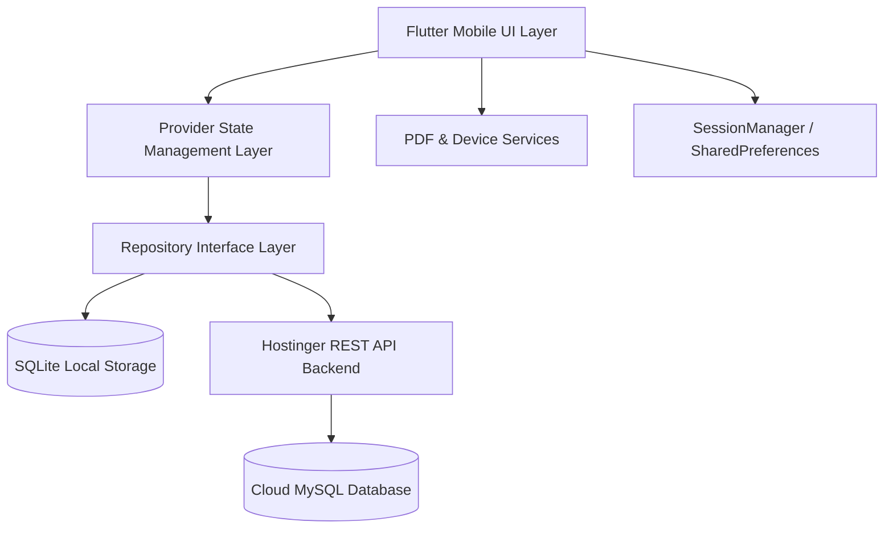

# Product Requirement Document (PRD) & AI System Blueprint
**Application Name**: My-Task (Household Helpers, Laundry & Appliance Maintenance Manager)  
**Package Identifier**: `todo`  
**Current Version**: `1.0.0+1`  
**Document Version**: `1.0.0`  
**Last Updated**: September 2026  

---

## 📌 INSTRUCTIONS FOR FUTURE AI AGENTS & DEVELOPERS
> [!IMPORTANT]
> **MANDATORY PROTOCOL**:
> 1. **Read This Document First**: Before implementing any feature, refactoring code, or debugging, thoroughly review this PRD to understand the architecture, design tokens, business logic, and established patterns.
> 2. **Maintain Documentation Integrity**: Whenever a new feature, database field, API endpoint, or UI overhaul is added, **YOU MUST UPDATE THIS PRD** (especially the **Data Models**, **API Contract**, and **Change Log & Roadmap** sections).
> 3. **Design Standard**: Always adhere to the **Mobile-First Compact Design System** (optimized for 360–412 dp physical devices). Never introduce oversized desktop padding or arbitrary conditional screen checks.
> 4. **Zero Error Policy**: Every code modification must pass `flutter analyze` with **0 errors and 0 warnings** and successfully compile via `flutter build apk --debug`.
> 5. **Sync Loaders**: Any new API or database operation must provide immediate visual feedback (button spinner, top linear progress bar, or centered loader). Never leave the UI in an unindicated or frozen state.

---

## 1. Executive Summary & Product Vision

### 1.1 Problem Statement
Urban households and domestic employers frequently struggle to manage informal domestic arrangements:
- **Attendance & Wage Confusion**: Domestic helpers (maids, cooks, drivers) often work on varying daily or monthly wage structures with unpredictable absences, late arrivals, and frequent cash advances. Disputes over monthly payouts are widespread.
- **Ironing & Laundry Discrepancies**: Dhobis/ironing vendors pick up clothes in irregular batches with distinct rates per clothing type (shirts, sarees, pants) and receive staggered cash payments, leading to record-keeping chaos.
- **Lost Appliance Warranties & Receipts**: Homeowners frequently misplace appliance purchase invoices, lose track of warranty expiry dates, and lack service histories when appliances breakdown.

### 1.2 Solution
**My-Task** is an all-in-one, executive-grade, compact mobile application that consolidates domestic management into three streamlined modules:
1. **Attendance & Wages Register** (Domestic helper roster, 1-tap quick check-in, offset tracking, advances, and auto-computed wage balances).
2. **Ironing & Laundry Registry** (Cloth count tallying, customized rate cards, wage calculation, and vendor payment tracking).
3. **Appliances & Maintenance Hub** (Asset warranty countdown, purchase invoices, and maintenance logs).

All data is synchronized with a secure cloud backend (`https://slateblue-guanaco-751834.hostingersite.com/api`) while supporting offline local persistence and a 30-day frictionless guest trial.

---

## 2. Technical Architecture & Tech Stack



### 2.1 Core Technologies
- **Framework**: Flutter (Channel stable, SDK `^3.11.3` / Dart 3.x)
- **UI Paradigm**: Material 3 with Custom Mobile-First Compact Theme
- **State Management**: `provider: ^6.1.5+1` (`ChangeNotifierProvider`)
- **Local Persistence**: `shared_preferences: ^2.5.5` (Session and preferences), SQLite (`sqflite`) for local caching
- **Networking**: `http: ^1.6.0` (REST JSON endpoints & multipart file upload)
- **Document Generation**: `pdf: ^3.11.1` & `printing: ^5.13.0`
- **Authentication**: Custom JWT/Session tokens + `google_sign_in: 6.2.1`
- **Device Integrations**: `image_picker: ^1.1.2`, `url_launcher: ^6.3.1`, `flutter_local_notifications: ^18.0.1`, `HapticFeedback`

### 2.2 Directory Structure
```
lib/
├── main.dart                      # App entry point, MultiProvider setup, theme definition
├── models/
│   ├── employee_model.dart        # Employee, AttendanceEntry, AttendanceStatus
│   ├── ironing_model.dart         # IroningWorker, IronRate, IroningRecord, IroningPayment
│   └── appliance_model.dart       # Appliance, ServiceRecord
├── providers/
│   ├── employee_provider.dart     # Staff & Ironing state management with loading flags
│   ├── appliance_provider.dart    # Appliance & Maintenance state management
│   └── theme_provider.dart        # Theme mode, guided tips, and customization settings
├── repositories/
│   ├── employee_repository.dart   # Abstract interface for staff & ironing
│   ├── api_employee_repository.dart   # Cloud API implementation
│   ├── local_employee_repository.dart # SQLite offline fallback
│   ├── appliance_repository.dart  # Abstract interface for appliances
│   ├── api_appliance_repository.dart  # Cloud API implementation
│   └── local_appliance_repository.dart# SQLite offline fallback
├── screens/
│   ├── auth_screen.dart           # Login, Register, Google Sign-In, Guest Trial
│   ├── main_dashboard_screen.dart # Executive Bottom Nav shell, Trial banner, Dialogs
│   ├── employee_management_screen.dart # Attendance roster, 1-tap quick buttons, calendar
│   ├── employee_detail_screen.dart# Staff financial profile, advance dialog, history
│   ├── ironing_dashboard_screen.dart # Laundry counter, rate cards, payments
│   ├── maintenance_screen.dart    # Appliance assets, warranty tracker, service logs
│   └── theme_settings_screen.dart # Profile edit, theme toggle, backup export
├── services/
│   └── pdf_service.dart           # Formatted PDF statement & roster generator
└── utils/
    └── session_manager.dart       # SharedPreferences wrapper for auth/guest tokens
```

---

## 3. Data Models & Entity Relationships

### 3.1 Domestic Helper (`Employee`)
```dart
class Employee {
  final String id;              // UUID or timestamp
  final String name;            // Helper full name
  final String contact;         // Phone number (digits only for dialer)
  final DateTime joiningDate;   // Start of employment
  final double baseSalary;      // Rate amount (₹)
  final String salaryBasis;     // 'daily' | 'monthly'
  final String? photoPath;      // Local file path or cloud URL
  final DateTime? relievingDate;// Relieving date (null if active)
}
```

### 3.2 Attendance Entry (`AttendanceEntry`)
```dart
enum AttendanceStatus { present, absent, late, early }

class AttendanceEntry {
  final String id;
  final String employeeId;
  final DateTime date;          // Normalized to year-month-day
  final AttendanceStatus status;// present, absent, late, early
  final String? checkInTime;    // e.g. "09:00"
  final String? checkOutTime;   // e.g. "18:00"
  final String? lateTime;       // Offset duration (e.g. "30 mins")
  final String? earlyTime;      // Offset duration (e.g. "1 hour")
  final double amountGiven;     // Cash advance paid on this date (₹)
  final String? paymentDescription; // Reason for payment/advance
}
```

### 3.3 Ironing Worker (`IroningWorker`)
```dart
class IroningWorker {
  final String id;
  final String name;
  final String contact;
  final DateTime joiningDate;
}
```

### 3.4 Cloth Ironing Rate (`IronRate`)
```dart
class IronRate {
  final String id;
  final String clothingType;    // "Shirt", "Pant", "Saree", "Others", or Custom
  final double rate;            // Unit rate in ₹ (e.g. 5.0, 10.0)
  final DateTime date;          // Effective date
}
```

### 3.5 Ironing Log Record (`IroningRecord`)
```dart
class IroningRecord {
  final String id;
  final String workerId;
  final DateTime date;
  final Map<String, int> clothesCount; // e.g. {"Shirt": 4, "Pant": 2}
  final double totalWage;       // Computed sum (count * rate)
  final DateTime createdAt;
}
```

### 3.6 Ironing Payment (`IroningPayment`)
```dart
class IroningPayment {
  final String id;
  final String workerId;
  final DateTime date;
  final double amount;          // Cash paid to vendor (₹)
  final String? description;
  final DateTime createdAt;
}
```

### 3.7 Household Appliance (`Appliance`)
```dart
class Appliance {
  final String id;
  final String name;            // e.g. "LG Washing Machine"
  final String type;            // Category (e.g. "Refrigerator", "AC")
  final String brand;           // Manufacturer (e.g. "Samsung")
  final String serialNumber;    // Model / Serial identifier
  final DateTime? warrantyStart;// Purchase date
  final DateTime? warrantyEnd;  // Expiration date
  final String? invoicePath;    // Photo receipt path
  final DateTime createdAt;
}
```

### 3.8 Appliance Service Record (`ServiceRecord`)
```dart
class ServiceRecord {
  final String id;
  final String applianceId;
  final DateTime serviceDate;
  final double price;           // Cost of repair/parts (₹)
  final String remarks;         // Technician notes
  final String? billPath;       // Service receipt photo
  final DateTime createdAt;
}
```

---

## 4. Detailed Feature Specifications

### 4.1 Authentication & Session Lifecycle
- **Guest Trial Mode**:
  - Automatically initializes new users with a 30-day trial without forcing sign-up.
  - Generates device identifier and computes countdown days.
  - Displays a subtle guest banner on the dashboard and trial badge dot on the settings tab.
  - Gracefully prompts for upgrade upon expiration or via the "Upgrade" dialog without data loss.
- **Account Creation & Sign In**:
  - Email/Password login and registration backed by Hostinger REST endpoints.
  - Google Sign-In (`google_sign_in`) integration.
  - Visual loaders: Button spinners on submit, top card linear progress bar, error snackbars.
- **Session Migration**:
  - Converting a guest account retains all locally created helpers, attendance, laundry, and appliance records and associates them with the permanent account ID.

### 4.2 Attendance Register & Wage Calculations
- **1-Tap Quick Action Buttons (Bilingual & Child/Homemaker Friendly)**:
  - Each employee card features large, tactile circular buttons:
    - `✓` **Present (आया)** in Emerald Green (`#10B981`)
    - `✕` **Absent (छुट्टी)** in Crimson Red (`#EF4444`)
  - **Spring Bouncing Animation**: `Curves.easeOutBack` scale transition (`1.0 -> 1.25 -> 1.0`) with tactile `HapticFeedback.mediumImpact()`.
  - **Smart Toggle**: Tapping the active state clears the entry.
  - **Bilingual Status Guidance**: Displays friendly hints (e.g. `"👉 Tap ✓ or ✕ to mark"`, `"✓ Present • आया"`, `"✕ Absent • छुट्टी"`).
- **One-Tap "All Present"**:
  - Emerald batch action button in the calendar toolbar that marks all active helpers Present for the chosen date with celebratory feedback (`"🎉 All N helpers marked Present!"`).
- **Wage Calculation Engine**:
  - **Daily Basis**: `Earned = Working Days * Daily Wage`.
  - **Monthly Basis**: `Daily Wage Rate = Base Monthly Salary / 30.0`. `Earned = Working Days * (Base Salary / 30.0)`.
  - **Balance**: `Pending Balance = Total Earned - Total Advances/Paid`. Positive is green ("Pending"), negative is red ("Overpaid").
- **Attendance Offsets & Shifts**:
  - Support for `Late Offset` (e.g., 30 mins late) and `Early Offset` (e.g., left 1 hour early) without marking helper absent.
- **PDF Reporting**:
  - Generates monthly attendance cards, helper wage receipts, and daily rosters via `PdfService`.

### 4.3 Ironing & Laundry Registry
- **Worker Selector**: Horizontal chip selector to switch between different ironing vendors.
- **Dynamic Rate Matrix**: Editable per-cloth rates (Shirt, Pant, Saree, Kurta, Others, Custom).
- **Batch Clothes Counter**:
  - Stepper controls (`+` / `-`) for each garment type.
  - Real-time computation of `Total Wage (₹)` based on selected rates.
- **Financial Balance Tracking**:
  - Calculates cumulative wages from clothes logs minus total payments given.
- **Logs Architecture**:
  - Smooth vertical scrolling without nested `TabBarView` height clipping bugs.

### 4.4 Appliance Warranty & Maintenance Hub
- **Warranty Monitor**:
  - Automatically calculates days remaining until warranty expires:
    - Active: Green shield badge (`"Active (142d left)"`).
    - Expired: Red warning badge (`"Expired"`).
- **Financial Analytics**:
  - Computes total home assets, count of active warranties, and total repair expenses across all assets.
- **Service Timeline**:
  - Chronological service logs per appliance with technician notes, repair costs, and invoice image previews.

### 4.5 Navigation Shell & Mobile Polish
- **Custom Executive Bottom Navigation Bar**:
  - 22 dp sliding top active indicator bar (`#10B981`).
  - Active tab micro-scale pill capsule (`primary.withAlpha(22–45)`) with spring scale.
  - `HapticFeedback.selectionClick()` on tab switches.
  - Adaptive surface and soft elevation (`#0F172A` in dark mode).
- **Mobile-First Compact Density**:
  - Standardized margins (`12–14 dp`), border radii (`12–16 dp`), button heights (`40–44 dp`).
  - Eliminates horizontal overflow and awkward vertical scroll clipping on 360–412 dp devices (e.g., Moto G45 5G).

---

## 5. Cloud API Contract (Hostinger REST Backend)

**Base URL**: `https://slateblue-guanaco-751834.hostingersite.com/api`  
**Authentication Header**: `X-User-Id: <userId>` or Bearer Token

| Endpoint | Method | Description | Request Payload / Headers |
| :--- | :--- | :--- | :--- |
| `/login` | `POST` | User login | `{"username": "...", "password": "..."}` |
| `/register` | `POST` | Create account | `{"username": "...", "password": "...", "deviceUuid": "..."}` |
| `/google-login` | `POST` | Google Sign-In | `{"idToken": "...", "email": "...", "displayName": "..."}` |
| `/convert-guest` | `POST` | Upgrade guest | `{"userId": "...", "username": "...", "password": "..."}` |
| `/get-profile` | `GET` | Fetch profile | Header: `X-User-Id` |
| `/update-profile` | `POST` | Edit profile | `{"username": "...", "password": "...", "profilePic": "..."}` |
| `/upload` | `POST` | Image upload | Multipart form: `file: <binary>` |
| `/employees` | `GET` | Get helper list | Header: `X-User-Id` |
| `/save-employee` | `POST` / `PUT` | Add/update helper | JSON Employee object |
| `/delete-employee`| `DELETE` | Delete helper | Query/Param: `id` |
| `/attendance` | `GET` | Get attendance | Query: `employeeId` |
| `/save-attendance`| `POST` | Save entry | JSON AttendanceEntry object |
| `/delete-attendance`| `DELETE` | Delete entry | Query: `employeeId`, `entryId` |
| `/ironing-workers` | `GET` | Get laundry staff | Header: `X-User-Id` |
| `/save-ironing-worker` | `POST` | Save laundry staff | JSON IroningWorker object |
| `/delete-ironing-worker` | `DELETE` | Delete laundry staff | Query: `id` |
| `/iron-rates` | `GET` / `POST` | Laundry rates | Query: `workerId` |
| `/ironing-records` | `GET` / `POST` | Clothes logs | Query: `workerId` |
| `/ironing-payments`| `GET` / `POST` | Vendor payments | Query: `workerId` |
| `/appliances` | `GET` | Get appliances | Header: `X-User-Id` |
| `/save-appliance`| `POST` / `PUT` | Add/update asset | JSON Appliance object |
| `/delete-appliance`| `DELETE` | Delete asset | Query: `id` |
| `/service-records` | `GET` / `POST` | Maintenance logs | Query: `applianceId` |

---

## 6. Design System Tokens & Guidelines

### 6.1 Module Accent Colors
```dart
class ModuleColors {
  static const Color attendance = Color(0xFF10B981); // Emerald Green
  static const Color attendanceDark = Color(0xFF059669);
  static const Color ironing = Color(0xFF3F51B5);    // Indigo
  static const Color appliances = Color(0xFF009688); // Teal
  static const Color finances = Color(0xFFF59E0B);   // Amber
  static const Color danger = Color(0xFFEF4444);     // Crimson
}
```

### 6.2 Spatial & Typography Rules
- **Screen Margins**: `const EdgeInsets.symmetric(horizontal: 12, vertical: 6)`
- **Card Margins**: `const EdgeInsets.symmetric(horizontal: 12, vertical: 4)`
- **Corner Radii**:
  - Cards: `12–14 dp`
  - Dialogs & Bottom Sheets: `16–20 dp`
  - Pill Badges & Chips: `99 dp` (Capsule)
- **Input Fields**:
  - Content padding: `horizontal: 12, vertical: 11`
  - `isDense: true`
  - `borderRadius: 12 dp`
- **Buttons**:
  - Height: `38–42 dp`
  - Font size: `12–13.5 sp`, `FontWeight.bold`

### 6.3 Haptic Feedback Standard
- **Tab Navigation**: `HapticFeedback.selectionClick()`
- **Attendance Mark/Unmark**: `HapticFeedback.mediumImpact()`
- **Batch / Destructive Actions**: `HapticFeedback.heavyImpact()`

---

## 7. Quality Assurance & Verification Standards

Any future modifications must strictly adhere to the following build gates:
1. **Lint & Analysis Gate**:
   ```bash
   flutter analyze
   ```
   *Requirement*: 0 errors, 0 warnings.
2. **Compilation Gate**:
   ```bash
   flutter build apk --debug
   flutter build apk --release
   ```
   *Requirement*: Exit code 0 with successful Gradle build.
3. **Hardware Verification**:
   - Check responsiveness on 360–412 dp Android physical screens.
   - Verify that soft keyboard appearance does not cause layout overflow.

---

## 8. Change Log & Feature Roadmap

### 8.1 Completed Milestones (v1.0.0)
- ✅ **Compact Mobile UI Transformation**: Standardized layout, typography, and densities for modern handheld devices.
- ✅ **Executive Bottom Navigation**: Custom bottom bar with active indicator line, pill capsules, haptics, and trial badge.
- ✅ **1-Tap Bilingual Attendance System**: Direct `✓` / `✕` buttons on helper cards with spring animations, smart toggle, bilingual hints, and "All Present" shortcut.
- ✅ **Executive Card Aesthetic & Seamless Attendance Toggle**: Eliminated murky greyish tint with crisp white surface styling, vibrant avatar gradients, status capsules, and fixed the absent/present toggle lifecycle by resolving duplicate key constraints in the REST backend and state provider.
- ✅ **Executive BottomSheet Dialog & Quick Pay Overhaul**: Upgraded quick actions modal with helper header, dynamic shift entries, bilingual status grid, quick amount preset chips (+₹500, +₹1000, +₹2000, +₹5000), and note quick tags.
- ✅ **View Profile & Financial Ledger Pages (v1.1.0)**: Overhauled `EmployeeDetailScreen` with deep indigo gradient header, circular tactile quick actions (Call, SMS, Share, Edit), pill-segmented TabBar, 3-metric Financial Summary Card with payout progress bar, receipt payment timeline cards, and TableCalendar attendance view.
- ✅ **Ironing & Laundry Registry Overhaul (v1.1.0)**: Upgraded `IroningDashboardScreen` with active worker switch bottomsheet, 3-metric financial overview (Earned, Paid, Balance) with settlement progress bar, interactive clothing rate chart matrix with custom rate support, real-time wage calculation modal for clothes given, preset payment modal (+₹200, +₹500, +₹1000, +₹2000), and receipt-styled timeline logs.
- ✅ **Complete API Loaders Suite**: Linear progress indicators across all headers, empty state fetch indicators, pull-to-refresh on all registry screens, and button circular spinners across all dialogs.
- ✅ **Appliances & Maintenance Hub Overhaul (v1.1.0)**: Modernized `MaintenanceScreen` and detail views with teal theme, 3-metric statistics banner, dynamic appliance category icons, warranty countdown pill badges, purchase bill preview with zoom modal, timeline service logs, and `_showAddServiceLogDialog` with preset cost chips.
- ✅ **Universal Modal & Dialog Suite Overhaul (v1.1.0)**: Modernized `EmployeeFormDialog`, `_showEditAttendanceDialog`, `_showTimeOffsetDialog`, `_showAddWorkerDialog`, `_showEditRatesDialog`, `_showAddClothesDialog`, and `_showAddApplianceDialog` with color-coded gradient headers, dark mode slate backgrounds, crisp input borders, preset quick chips, and loading state protection.
- ✅ **Settings & Account Management Overhaul (v1.1.0)**: Modernized `ThemeSettingsScreen` with visual Light/Dark mode selector cards, user profile header with halo avatars, Gold/Amber subscription status cards, modern backup export/restore modals, and session logout dialogs.
- ✅ **Hostinger Cloud Sync Integration**: REST endpoints for staff, attendance, laundry, appliances, and user sessions.

### 8.2 Future Planned Roadmap (Backlog for Future Updates)
- [ ] **Offline Sync Queue**: Implement local SQLite queue that automatically pushes mutations to the cloud when internet connection is restored.
- [ ] **Biometric App Lock**: Fingerprint / Face Unlock for domestic salary and advance confidentiality.
- [ ] **Push Notification Reminders**: Evening notification if daily attendance for any helper remains unmarked.
- [ ] **WhatsApp Payment Slips**: 1-click generation and sharing of wage receipts directly to helpers' WhatsApp numbers.
- [ ] **Multi-Language Roster**: Full Hindi, Marathi, and Tamil localization toggles in Settings.
